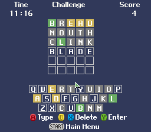

# Satebo's Wordgame (SFC Satellaview Homebrew)

  

Satebo's Wordgame is a homebrew game for the [Satellaview](https://en.wikipedia.org/wiki/Satellaview) (the Super Famicom extension). \
It is an implementation of the [Wordle](https://en.wikipedia.org/wiki/Wordle) game, developped by Josh Wardle, that became popular in 2021 before being bought by the New York Times.

The game is named after Satebo, one of the two Satellaview mascots. \
Why did you spell wordgame in one word? I don't know, why is wargame spelled in one word?
My prototype was called Super Wordle but I'd rather not get sued by the NYT.

## Emulation
\
The game works on:
- **snes9x-1.61**
- **bsnes-plus**

Requirement: [BS-X BIOS (English) - No DRM - 2016 v1.3](https://project.satellaview.org/downloads.htm) \
**Make sure to turn on the option "Get BS-X date and time from local time"**

I couldn't make the game work on:
- no$sns
- bsnes v115
- mesen

###Why does the game not work on emulator X?

The game uses the channel feature of the Satellaview (specifically the Time Channel Packet) in order to get the current date and time.\
That feature is documented there: [SNES Cart Satellaview Other Packets](https://problemkaputt.de/fullsnes.htm#snescartsatellaviewotherpackets) \
The current date is used for the Daily Word and the time is used for the timers (I could have used a timer based on the frame count but I needed the date anyway).\
Unfortunately, many emulators do not emulate that feature well, if at all. The code I use to read the channel data from the ad-hoc register is taken from the game BS-Kodomo-Chousadan which is itself not emulated well by all emulators.

## Gameplay

You have 6 guesses to find a 5-letter word. \
Each guess must be a valid word found in the dictionary (the included one has about 13000 words). \
The solution is taken from a smaller set of 2300 words.

## Game Modes

### Practice

Play as long as you want. You can press Select to get a new word.

### Daily Word

You can play this mode once a day. \
Each day has a predetermined solution.

### Time Attack

Try to find a number of words (5, 10 or 15) as fast as possible.

### Challenge

Try to find as many words as you can in 15 minutes. \
Like many Satellaview puzzle games, at the end of the 15 min, you are shown a "password" postcard. \
The password encodes your score (words and guesses) to be verifiable. \

  \
 